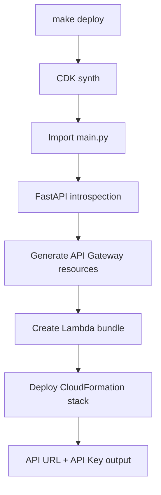

# FastAPI to CDK Gateway

[](https://github.com/bayesjumping/fastapi_gateway/actions/workflows/tests.yml)
[](https://codecov.io/gh/bayesjumping/fastapi_gateway)

Automatically deploy your FastAPI application to AWS API Gateway with Lambda, using AWS CDK.

## Overview

This project automatically converts your FastAPI application into AWS infrastructure using CDK. The CDK code **reads your FastAPI app at runtime** and generates:

- ✅ API Gateway REST API with all your endpoints
- ✅ Lambda function with your application code
- ✅ API Key authentication
- ✅ Request validation from Pydantic models
- ✅ Usage plans and throttling



## Project Structure

```
fastapi_gateway/
├── main.py              # FastAPI application entry point
├── app/
│   ├── __init__.py
│   ├── runtime/         # Lambda runtime adapter
│   │   ├── __init__.py
│   │   └── lambda_handler.py
│   ├── routers/         # API route definitions
│   │   ├── __init__.py
│   │   └── example.py   # Example router with CRUD operations
│   ├── models/          # Pydantic models
│   │   └── __init__.py
│   ├── services/        # Business logic
│   └── db/              # Database layer
├── infra/               # AWS CDK infrastructure
│   ├── app.py
│   ├── stacks/
│   │   └── gateway_stack.py
│   └── introspection/
│       └── fastapi_introspector.py
├── build/               # Build artifacts (ignored)
├── scripts/
│   ├── deploy.sh         # Deployment script
│   ├── destroy.sh        # Cleanup script
│   ├── generate_openapi.sh # OpenAPI schema generator
│   └── setup.sh          # Quick setup script
├── requirements.txt     # Python dependencies
├── makefile            # Build and setup commands
└── .gitignore
```

## Prerequisites

Before you begin, ensure you have:

1. **AWS Account** with credentials configured
2. **AWS CLI** installed and configured (`aws configure`)
3. **Python 3.11+** installed
4. **Node.js & npm** installed (for CDK CLI)

## Getting Started

### Step 1: Complete Setup

Run one command to set everything up:

```bash
make setup
```

This will:
- ✅ Create Python virtual environment
- ✅ Install all Python dependencies
- ✅ Install AWS CDK CLI globally
- ✅ Show you next steps

### Step 2: Configure AWS Credentials

**Recommended: AWS SSO with temporary tokens**

```bash
aws sso configure
aws sso login
```

**Alternative: Static credentials**

If you're not using AWS SSO:

```bash
aws configure
```

Enter your:
- AWS Access Key ID
- AWS Secret Access Key
- Default region (e.g., `us-east-1`)

### Step 3: Bootstrap CDK (First Time Only)

```bash
# Activate virtual environment
source .venv/bin/activate

# Bootstrap CDK
make bootstrap
```

### Step 4: Deploy to AWS

```bash
make deploy
```

If you use AWS SSO, log in and pass your profile:

```bash
aws sso login --profile bayesjumping
AWS_PROFILE=bayesjumping make deploy
```

Or call the script directly:

```bash
AWS_PROFILE=bayesjumping ./scripts/deploy.sh
```

This single command will:
1. ✅ Check AWS credentials
2. ✅ Bootstrap CDK (if needed)
3. ✅ Read your FastAPI app and introspect routes/models
4. ✅ Generate CloudFormation template
5. ✅ Deploy to AWS
6. ✅ Output your API URL and API Key

**Total deployment time**: ~3-5 minutes

After deployment completes, retrieve your API URL and Key from the stack outputs:

```bash
# Get stack outputs
aws cloudformation describe-stacks \
  --stack-name FastApiGatewayStack \
  --query 'Stacks[0].Outputs'

# Get API Key value
aws apigateway get-api-key \
  --api-key YOUR_KEY_ID \
  --include-value \
  --query 'value' \
  --output text
```

### Step 5: Test Your Deployed API

**Test the API:**

```bash
# Health check
curl -H "x-api-key: YOUR_API_KEY" YOUR_API_URL/health

# Get all todos
curl -H "x-api-key: YOUR_API_KEY" YOUR_API_URL/api/v1/todos

# Create a todo
curl -X POST \
  -H "x-api-key: YOUR_API_KEY" \
  -H "Content-Type: application/json" \
  -d '{"title":"My first todo","priority":"high"}' \
  YOUR_API_URL/api/v1/todos

# Get specific todo
curl -H "x-api-key: YOUR_API_KEY" YOUR_API_URL/api/v1/todos/1
```

## Run Locally

```bash
make run
```

The API will be available at http://localhost:8000

### API Documentation

Once running locally, visit:
- Swagger UI: http://localhost:8000/docs
- ReDoc: http://localhost:8000/redoc

## Available Endpoints

### Health & Info
- `GET /` - Root endpoint with API information
- `GET /health` - Health check

### Todo API
- `GET /api/v1/todos` - List all todos (with filtering)
- `GET /api/v1/todos/{id}` - Get specific todo
- `POST /api/v1/todos` - Create new todo
- `PUT /api/v1/todos/{id}` - Update todo
- `PATCH /api/v1/todos/{id}/toggle` - Toggle completion status
- `DELETE /api/v1/todos/{id}` - Delete todo
- `DELETE /api/v1/todos` - Delete all completed todos

## 🎯 How the Dynamic Generation Works

When you run `make deploy`, here's what happens:

```
1. CDK starts synthesis (cdk synth)
        ↓
2. infra/stacks/gateway_stack.py imports main.py
        ↓
3. FastAPIIntrospector reads the FastAPI app
        ↓
4. Extracts all routes, methods, paths
        ↓
5. Converts Pydantic models to JSON Schema
        ↓
6. Generates API Gateway resources/methods
        ↓
7. Creates CloudFormation template
        ↓
8. Deploys to AWS
```


**The magic**: No manual configuration needed! Just write FastAPI code normally.

## 📝 Example: Adding a New Endpoint

Want to add a new API endpoint? Just add it to your FastAPI app:

```python
# In app/routers/example.py

@router.get("/users")
async def get_users():
    return {"users": ["Alice", "Bob"]}
```

Then redeploy:

```bash
make deploy
```

The new endpoint will **automatically** appear in API Gateway!

## Make Commands

```bash
make help         # Show all available commands
make setup        # Complete setup (venv + dependencies + CDK)
make install      # Install Python dependencies only
make bootstrap    # Bootstrap AWS CDK
make run          # Run FastAPI server locally
make test         # Run test suite
make deploy       # Deploy to AWS
make destroy      # Remove AWS resources
make openapi      # Generate OpenAPI schema
make clean        # Clean virtual environment
```

## 🔧 Common Tasks

### View CloudFormation Template

```bash
source .venv/bin/activate
cdk synth
```

Output will be in `cdk.out/FastApiGatewayStack.template.json`

### Check What Will Change

Before deploying:

```bash
source .venv/bin/activate
cdk diff
```

### View Deployment Logs

```bash
# Lambda logs
aws logs tail /aws/lambda/FastApiGatewayStack-FastApiHandler --follow

# API Gateway logs
aws logs tail /aws/apigateway/FastApiGateway --follow
```

### Retrieve API Key Later

```bash
# Get stack outputs
aws cloudformation describe-stacks \
  --stack-name FastApiGatewayStack \
  --query 'Stacks[0].Outputs'

# Get API Key value
aws apigateway get-api-key \
  --api-key YOUR_KEY_ID \
  --include-value \
  --query 'value' \
  --output text
```

## 🗑️ Cleanup

To remove all AWS resources:

```bash
make destroy
```

This deletes:
- API Gateway
- Lambda function
- API Keys and Usage Plans
- CloudWatch Logs
- All IAM roles

## 💰 Costs

AWS charges for:
- **API Gateway**: $3.50 per million requests + data transfer
- **Lambda**: First 1M requests/month free, then $0.20 per 1M requests
- **CloudWatch Logs**: $0.50 per GB ingested

**Estimated cost** for light usage: ~$1-5/month

## 🐛 Troubleshooting

### "AWS credentials not configured"

```bash
aws configure
# Enter your credentials
```

### "CDK not bootstrapped"

```bash
make bootstrap
```

### "Module not found" errors

```bash
make install
source .venv/bin/activate
```

### Lambda function errors

Check logs:
```bash
aws logs tail /aws/lambda/FastApiGatewayStack-FastApiHandler --follow
```

### API returns 403 Forbidden

- Make sure you're sending the `x-api-key` header
- Verify the API Key value is correct
- Check the Usage Plan is associated with the API

## 📚 What Was Created

After running the setup, you now have:

### Infrastructure Files:
- `app/runtime/lambda_handler.py` - Lambda entry point with Mangum
- `infra/app.py` - CDK application entry point
- `infra/stacks/gateway_stack.py` - Dynamic CDK stack generator
- `infra/introspection/fastapi_introspector.py` - Route/model introspection
- `scripts/deploy.sh` - Deployment script
- `scripts/destroy.sh` - Cleanup script
- `scripts/generate_openapi.sh` - OpenAPI schema generator (writes to build/openapi/openapi.json)
- `infra/requirements-lambda.txt` - Lambda runtime dependencies
- `cdk.json` - CDK configuration

### Modified Files:
- `requirements.txt` - Added `mangum` for Lambda support

### What Runs Where:
- **Locally**: FastAPI app runs with uvicorn for development
- **AWS Lambda**: FastAPI app runs via Mangum adapter
- **CDK Synthesis**: Introspector reads FastAPI app to generate infrastructure
- **API Gateway**: Routes requests to Lambda with validation

## 🎓 Next Steps

1. **Customize**: Edit `infra/stacks/gateway_stack.py` to adjust Lambda size, timeouts, etc.
2. **Add Storage**: Replace in-memory storage with DynamoDB
3. **Add Auth**: Implement Cognito or custom authorizers
4. **Monitor**: Set up CloudWatch dashboards and alarms
5. **CI/CD**: Automate deployment with GitHub Actions or CodePipeline

## 📖 Learn More

- [AWS CDK Docs](https://docs.aws.amazon.com/cdk/)
- [API Gateway Docs](https://docs.aws.amazon.com/apigateway/)
- [FastAPI Docs](https://fastapi.tiangolo.com/)
- [Mangum Docs](https://mangum.io/)
